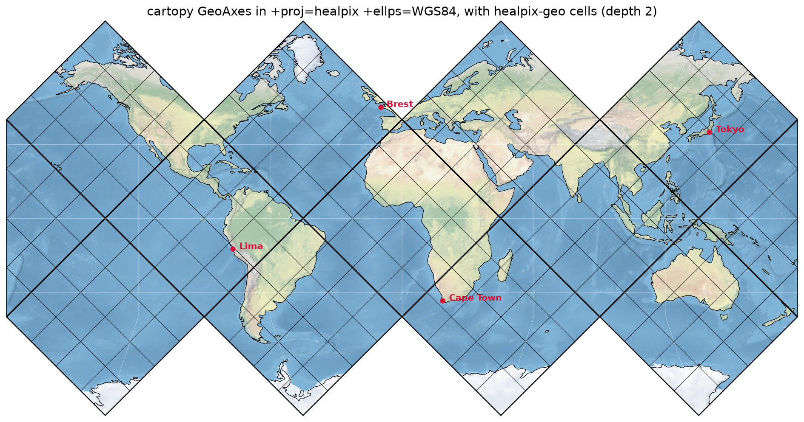
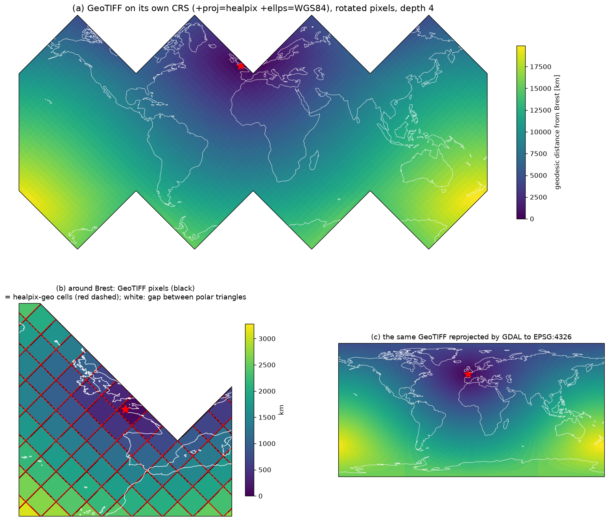
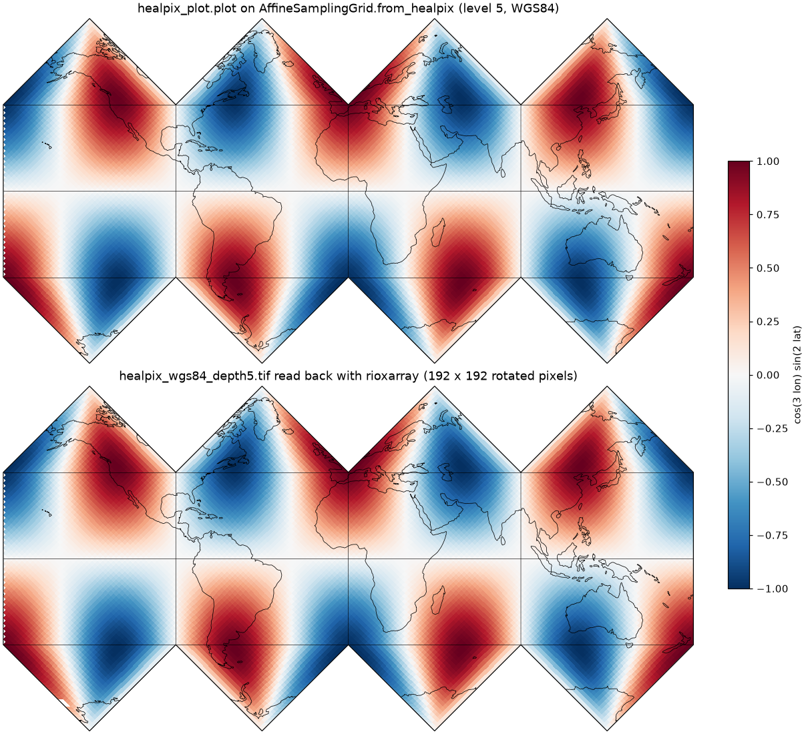

# healpix-geo × PROJ (`+proj=healpix`) consistency check

[](https://github.com/GRID4EARTH/healpix-proj/actions/workflows/verify.yml)

Checks that the ellipsoidal HEALPix cells of
[healpix-geo](https://github.com/GRID4EARTH/healpix-geo) match PROJ's
`+proj=healpix` projection exactly, so that projection can serve as the CRS of
a GeoTIFF holding healpix-geo data.


The cell vertices returned by healpix-geo's `vertices(..., ellipsoid="WGS84")`,
projected as-is with `+proj=healpix +ellps=WGS84` (no hand-written unfolding).
Colours are the 12 base cells (depth 0, labelled `base N`); numbers are the
NESTED cell IDs at depth 1 (the base cell of an ID is `ID // 4**depth`).
The cells tile the plane with no gaps or overlaps, which is a visual check that
healpix-geo and PROJ agree.
Other depths: [depth 0](docs/images/healpix_wgs84_depth0.png) /
[depth 2](docs/images/healpix_wgs84_depth2.png)

## Background

GeoTIFF expects a regular grid, an affine transform and a CRS; HEALPix is a
hierarchical cell index on the sphere, and there is no EPSG code or GeoKey for
it. Two ways around this were considered:

- **rHEALPix** rearranges the polar facets into a seamless rectangle, which
  suits GeoTIFF, but it loses HEALPix's iso-latitude property and uses
  3×3 (aperture 9) refinement. Its cell IDs do not correspond to healpix-geo's,
  so converting to it is a re-gridding onto another DGGS.
- **PROJ's `+proj=healpix`** builds ellipsoidal HEALPix the same way healpix-geo
  does (ellipsoid → authalic sphere → HPX projection). If the two agree
  exactly, standard HEALPix can be used as a GeoTIFF CRS directly.

This repository tests the second option. The full investigation is in
[docs/investigation.md](docs/investigation.md). How the CRS could be
standardised (EPSG registration, GeoTIFF) is discussed in
[docs/standardisation.md](docs/standardisation.md).

## Setup

Python 3.10 or later.

```bash
python3 -m venv venv
source venv/bin/activate   # Windows: venv\Scripts\activate
pip install -r requirements.txt
pip install cartopy pykdtree rasterio   # optional: figures, the cartopy and GeoTIFF examples
```

## Usage

```bash
# Default: both sphere and WGS84, depth 1-4
python scripts/verify_healpix_proj.py

# Choose the ellipsoid(s)
python scripts/verify_healpix_proj.py --ellipsoid WGS84
python scripts/verify_healpix_proj.py --ellipsoid unitsphere sphere WGS84 GRS80

# Choose the depths (resolutions)
python scripts/verify_healpix_proj.py --ellipsoid WGS84 --depths 1 2 3 4 5 6

# Other central meridians: multiples of 90 pass, anything else fails
python scripts/verify_healpix_proj.py --lon-0 90

# Regenerate the figure (coastlines are drawn only if cartopy is installed)
python scripts/plot_healpix_map.py --depth 1   # -> docs/images/healpix_wgs84_depth1.png

# GeoTIFF example: write, check and plot (needs rasterio, cartopy and pykdtree or scipy)
python scripts/healpix_geotiff.py --depth 4 --tiff healpix_wgs84.tif   # -> docs/images/healpix_geotiff.png

# Cartopy example (needs cartopy and pykdtree or scipy)
python scripts/plot_healpix_cartopy.py --depth 2   # -> docs/images/healpix_cartopy.png
```

`verify_healpix_proj.py` exits with `0` if every check passes and `1` if an
inconsistency is found. CI runs it on every push
([.github/workflows/verify.yml](.github/workflows/verify.yml)).

## Using the projection in cartopy



`ccrs.Projection([("proj", "healpix")])` on its own raises `NotImplementedError`,
because cartopy also needs the map domain. `scripts/plot_healpix_cartopy.py`
defines a `HEALPix` CRS that supplies it (the equatorial band plus the polar
triangles), so the usual cartopy tools work: `stock_img`, `coastlines`,
`add_feature`, gridlines, and any data passed with
`transform=ccrs.PlateCarree()` (the red points above).

```python
import sys; sys.path.insert(0, "scripts")
import cartopy.crs as ccrs
import matplotlib.pyplot as plt
from plot_healpix_cartopy import HEALPix, add_healpix_cells

crs = HEALPix()                      # +proj=healpix +ellps=WGS84 +lon_0=0
ax = plt.axes(projection=crs)
ax.set_global()
ax.stock_img()
ax.coastlines()
add_healpix_cells(ax, crs, depth=2, facecolor="none", edgecolor="k", linewidth=0.4)
```

healpix-geo cells are drawn from coordinates that are already projected
(with the seam handling described below), not re-projected by cartopy, so
they are never cut at the facet seams.

## Writing healpix-geo data to a GeoTIFF



`scripts/healpix_geotiff.py` writes a value per healpix-geo cell (here the
WGS84 geodesic distance from Brest) to a GeoTIFF, reads it back and plots it.

- **One pixel = one cell.** On the HEALPix plane every cell is a square rotated
  by 45°, so the raster uses a rotated affine transform (stored as
  `ModelTransformationTag`) with pixel centres on cell centres. At depth 4 the
  96 × 96 raster holds all 3072 cells, the pixel centres are within 2·10⁻¹⁴
  pixel of the cell centres, and panel (b) shows the pixels coinciding with the
  cells drawn by healpix-geo. Pixels in the gaps between polar triangles are
  nodata; cells cut by the map edge appear at both edges (16 pixels).
- **The CRS lives in a side-car file.** GeoTIFF has no GeoKeys for the HEALPix
  projection, so GDAL keeps the CRS in `<name>.tif.aux.xml`; without it the
  .tif has no CRS. The script therefore also stores the CRS (WKT), the depth,
  the ellipsoid and the indexing scheme in the TIFF metadata
  (`healpix_crs_wkt`, `healpix_depth`, ...), and `healpix_crs()` restores the
  CRS from there.
- **GDAL can reproject it, with one option.** Across the projection's cuts
  GDAL underestimates the source window it needs and leaves wedge-shaped holes.
  With the warp option `SOURCE_EXTRA` set to the raster size
  (`gdalwarp -wo SOURCE_EXTRA=96 ...`) every pixel of the EPSG:4326 output gets
  the value of the cell containing it (checked for all pixels of a 0.5° grid),
  panel (c).

## What is checked

1. **Shape test**: the 4 vertices of *every* cell at each depth are projected
   with `+proj=healpix` and must form a square (diamond): equal width and
   height, equal diagonals (relative tolerance 1e-6).
2. **Tiling test**: every pair of edge neighbours must still share an edge
   (2 vertices) after projection, i.e. no gaps and no overlaps. The only
   exception is pairs whose shared edge is a cut between two polar triangles
   (e.g. base cells 0 and 1); those must *not* touch on the plane.
3. **Round-trip test**: forward then inverse projection must return the
   original longitude/latitude (consistency of PROJ's forward/inverse).

## Results

- **Every cell matches between healpix-geo and PROJ**, with no exceptions:
  all 12·4^depth cells for depth 1–4, in the equatorial and polar zones alike,
  for the unit sphere, healpix-geo's `sphere` (R = 6370997 m), WGS84 and GRS80 (max shape error ~5·10⁻⁸, round-trip error
  ~10⁻¹³ degrees).
- **All edge neighbours share their edge**, and the only pairs that do not are
  exactly those across a polar cut, as the projection requires.
- **Handling the seams.** HEALPix (HPX) is an *interrupted* projection: a
  vertex lying exactly on a cut (a pole, a polar facet boundary meridian, the
  map edge) has no unique plane position. Both scripts therefore move every
  vertex a tiny fraction (10⁻⁷ of its offset) towards its own cell centre
  before projecting, so each cell lands entirely on its own facet. Without this
  step some polar cells look distorted, which is an artefact of the test, not
  a healpix-geo/PROJ mismatch.
- **The check does catch real mismatches**: `lon_0=45` or `lon_0=10` makes
  the polar cells non-square, and pairing healpix-geo's sphere with PROJ's
  WGS84 makes every cell non-square (error ~4·10⁻³).

## Practical notes for GeoTIFF

- **Use exactly the same ellipsoid** on both sides (`+ellps=` / `+a=` / `+rf=`).
- **`lon_0` must be a multiple of 90°** (see below).
- **Pixels are diamonds rotated 45°** relative to the projected axes, so one
  pixel per cell needs an affine transform with a rotation term
  (e.g. ModelTransformationTag), and the origin and resolution must be aligned
  to the depth explicitly.
- **No EPSG code and no GeoKeys**: the CRS is a custom WKT that GDAL keeps in a
  `.aux.xml` side-car; store it in the TIFF metadata as well (see above).
  Portability outside PROJ-based software (the GDAL family) is limited.
- **Reprojecting with GDAL** needs the warp option `SOURCE_EXTRA` (see above).

### Seams and `lon_0`

The plane has two kinds of cuts (both visible in the figure above):

- the left/right edge of the map at `lon_0 ± 180°`, which cuts through all
  latitudes;
- the gaps between the polar triangles, at `lon_0 + 0°, 90°, 180°, 270°`
  poleward of about ±42° latitude.

healpix-geo's cells are fixed on the globe (base cell 0 is centred on 45°E),
so the projection's facets only line up with the cells when **`lon_0` is a
multiple of 90°**. With any other value PROJ cuts cells in half: at depth 1,
`lon_0=10` or `lon_0=45` leaves 24 of the 48 cells non-square, while `lon_0=0`
and `lon_0=90` leave none. Changing `lon_0` therefore cannot remove the seams;
it only chooses which equatorial base cell is split by the map edge (base cell
6 for `lon_0=0`, base cell 7 for `lon_0=90`, ...). When rasterising data that
crosses a seam, split the data at the seam instead.

## Lossless GeoTIFF with healpix-plot (towards xdggs)



`scripts/healpix_geotiff.py` above builds the one-pixel-per-cell raster by
hand with rasterio. For xdggs the same idea has to live in a library:
[`patches/0001-healpix-plot-crs-sampling-grid.patch`](patches/0001-healpix-plot-crs-sampling-grid.patch)
adds it to [healpix-plot](https://github.com/GRID4EARTH/healpix-plot), whose
sampling grids already turn cell ids into regular rasters (it applies cleanly
to commit `42a6d04`, August 2026):

- `AffineSamplingGrid` takes a `crs` and follows the rasterio conventions
  (corner transform, `(height, width)` shape); `from_raster()` takes the grid
  of a rasterio dataset or a rioxarray `DataArray`.
- `AffineSamplingGrid.from_healpix(healpix_grid)` builds the cell-aligned
  grid in `+proj=healpix` (one pixel per cell, level ≥ 1, `lon_0` a multiple
  of 90°). Resampling onto it is lossless.
- `healpix_plot.raster.to_dataarray()` wraps the image into a georeferenced
  `xarray.DataArray` (CRS and transform via rioxarray, so `.rio.to_raster()`
  writes the GeoTIFF, plus the same `healpix_crs_wkt` / `healpix_depth` /
  `healpix_ellipsoid` / `healpix_indexing_scheme` tags as
  `scripts/healpix_geotiff.py`); `raster_cell_ids()` recovers the cell id
  under every pixel of an existing raster.
- `healpix_plot.HEALPix` is the cartopy projection from
  `scripts/plot_healpix_cartopy.py`, and `plot(..., projection="HEALPix")`
  draws the rotated grid undistorted.

```bash
cd ../healpix-plot && git apply ../healpix_proj/patches/0001-healpix-plot-crs-sampling-grid.patch
```

`scripts/healpix_geotiff_roundtrip.py` runs the whole path (needs the
patched healpix-plot, rasterio and rioxarray): resample a field onto the
cell-aligned grid, write it with rioxarray, read it back with rasterio,
recover the cell ids from the pixel positions alone, and compare.

```bash
python scripts/healpix_geotiff_roundtrip.py --level 5 --ellipsoid WGS84 --figure docs/images/healpix_plot_geotiff.png
```

Checked at levels 5 and 8 on WGS84: the CRS, transform and shape survive the
GeoTIFF, every cell is exactly one pixel, pixels off the globe are nodata, and
every value is recovered exactly. Level 8 (786 432 cells, a 1536 × 1536
raster) takes about 0.3 s to write and 0.2 s to read and decode.

What this means for the plumbing:

- **rasterio and rioxarray can be reused as they are**, with the side-car
  caveat from the previous section: the rotated transform goes into the
  GeoTIFF, but the CRS only into `<file>.tif.aux.xml`. `to_dataarray()`
  therefore writes the CRS as WKT into the TIFF tags as well, and
  `from_raster()` / `raster_cell_ids()` fall back to that tag (tested with the
  side-car deleted). rioxarray only warns that it cannot derive 1D `x`/`y`
  coordinates for a rotated raster, which is expected.
- **xdggs does not need a rasterio dependency.** A `to_raster()`-style method
  can return the `DataArray` from `to_dataarray()` and leave the writing to
  rioxarray; the reverse direction is `raster_cell_ids()` followed by the
  usual xdggs decoding. The resampling itself stays in healpix-plot.
- **Known limits.** No EPSG code and no GeoKeys (see
  [docs/standardisation.md](docs/standardisation.md)), so software outside
  the GDAL/PROJ family may not read the CRS. Unlike `scripts/healpix_geotiff.py`,
  the antimeridian is assigned to the `+180°` side only, so each cell is one
  pixel but the left edge of the full map loses a sawtooth of half pixels
  (visible in the figure). Interpolating across facet seams in this projection
  is wrong, as the projection is interrupted there.

## Repository layout

```
.
├── README.md
├── LICENSE
├── requirements.txt
├── scripts/
│   ├── verify_healpix_proj.py   # the consistency checks
│   ├── plot_healpix_map.py      # generates the cell-ID figures
│   ├── plot_healpix_cartopy.py  # cartopy CRS for +proj=healpix, and its figure
│   └── healpix_geotiff.py       # write, check and plot a HEALPix GeoTIFF
├── docs/
│   ├── investigation.md         # background and detailed findings
│   └── images/                  # figures used in this README
└── .github/workflows/verify.yml # CI
```
