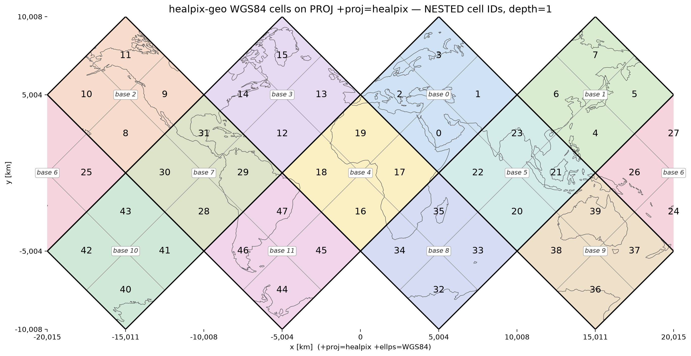

# healpix-geo × PROJ (`+proj=healpix`) consistency check

[](https://github.com/GRID4EARTH/healpix-proj/actions/workflows/verify.yml)

Checks that the ellipsoidal HEALPix cells of
[healpix-geo](https://github.com/GRID4EARTH/healpix-geo) match PROJ's
`+proj=healpix` projection exactly, so that projection can serve as the CRS of
a GeoTIFF holding healpix-geo data.



The cell vertices returned by healpix-geo's `vertices(..., ellipsoid="WGS84")`,
projected as-is with `+proj=healpix +ellps=WGS84` (no hand-written unfolding).
Colours are the 12 base cells (depth 0, labelled `base N`); numbers are the
NESTED cell IDs at depth 1 (the base cell of an ID is `ID // 4**depth`).
The cells tile the plane with no gaps or overlaps, which is a visual check that
healpix-geo and PROJ agree.
Other depths: [depth 0](docs/images/healpix_wgs84_depth0.png) /
[depth 2](docs/images/healpix_wgs84_depth2.png)

## Background

GeoTIFF expects a regular grid, an affine transform and a CRS; HEALPix is a
hierarchical cell index on the sphere, and there is no EPSG code or GeoKey for
it. Two ways around this were considered:

- **rHEALPix** rearranges the polar facets into a seamless rectangle, which
  suits GeoTIFF, but it loses HEALPix's iso-latitude property and uses
  3×3 (aperture 9) refinement. Its cell IDs do not correspond to healpix-geo's,
  so converting to it is a re-gridding onto another DGGS.
- **PROJ's `+proj=healpix`** builds ellipsoidal HEALPix the same way healpix-geo
  does (ellipsoid → authalic sphere → HPX projection). If the two agree
  exactly, standard HEALPix can be used as a GeoTIFF CRS directly.

This repository tests the second option. The full investigation is in
[docs/investigation.md](docs/investigation.md).

## Setup

Python 3.10 or later.

```bash
python3 -m venv venv
source venv/bin/activate   # Windows: venv\Scripts\activate
pip install -r requirements.txt
pip install cartopy        # optional: only used to draw coastlines on the figure
```

## Usage

```bash
# Default: both sphere and WGS84, depth 1-4
python scripts/verify_healpix_proj.py

# Choose the ellipsoid(s)
python scripts/verify_healpix_proj.py --ellipsoid WGS84
python scripts/verify_healpix_proj.py --ellipsoid sphere WGS84 GRS80

# Choose the depths (resolutions)
python scripts/verify_healpix_proj.py --ellipsoid WGS84 --depths 1 2 3 4 5 6

# Other central meridians: multiples of 90 pass, anything else fails
python scripts/verify_healpix_proj.py --lon-0 90

# Regenerate the figure (coastlines are drawn only if cartopy is installed)
python scripts/plot_healpix_map.py --depth 1   # -> docs/images/healpix_wgs84_depth1.png
```

`verify_healpix_proj.py` exits with `0` if every check passes and `1` if an
inconsistency is found. CI runs it on every push
([.github/workflows/verify.yml](.github/workflows/verify.yml)).

## What is checked

1. **Shape test**: the 4 vertices of *every* cell at each depth are projected
   with `+proj=healpix` and must form a square (diamond): equal width and
   height, equal diagonals (relative tolerance 1e-6).
2. **Tiling test**: every pair of edge neighbours must still share an edge
   (2 vertices) after projection, i.e. no gaps and no overlaps. The only
   exception is pairs whose shared edge is a cut between two polar triangles
   (e.g. base cells 0 and 1); those must *not* touch on the plane.
3. **Round-trip test**: forward then inverse projection must return the
   original longitude/latitude (consistency of PROJ's forward/inverse).

## Results

- **Every cell matches between healpix-geo and PROJ**, with no exceptions:
  all 12·4^depth cells for depth 1–4, in the equatorial and polar zones alike,
  for the sphere, WGS84 and GRS80 (max shape error ~5·10⁻⁸, round-trip error
  ~10⁻¹³ degrees).
- **All edge neighbours share their edge**, and the only pairs that do not are
  exactly those across a polar cut, as the projection requires.
- **Handling the seams.** HEALPix (HPX) is an *interrupted* projection: a
  vertex lying exactly on a cut (a pole, a polar facet boundary meridian, the
  map edge) has no unique plane position. Both scripts therefore move every
  vertex a tiny fraction (10⁻⁷ of its offset) towards its own cell centre
  before projecting, so each cell lands entirely on its own facet. Without this
  step some polar cells look distorted, which is an artefact of the test, not
  a healpix-geo/PROJ mismatch.
- **The check does catch real mismatches**: `lon_0=45` or `lon_0=10` makes
  the polar cells non-square, and pairing healpix-geo's sphere with PROJ's
  WGS84 makes every cell non-square (error ~4·10⁻³).

## Practical notes for GeoTIFF

- **Use exactly the same ellipsoid** on both sides (`+ellps=` / `+a=` / `+rf=`).
- **`lon_0` must be a multiple of 90°** (see below).
- **Pixels are diamonds rotated 45°** relative to the projected axes, so one
  pixel per cell needs an affine transform with a rotation term
  (e.g. ModelTransformationTag), and the origin and resolution must be aligned
  to the depth explicitly.
- **No EPSG code**: the CRS is embedded as a PROJ string / custom WKT, so
  portability outside PROJ-based software (the GDAL family) is limited.

### Seams and `lon_0`

The plane has two kinds of cuts (both visible in the figure above):

- the left/right edge of the map at `lon_0 ± 180°`, which cuts through all
  latitudes;
- the gaps between the polar triangles, at `lon_0 + 0°, 90°, 180°, 270°`
  poleward of about ±42° latitude.

healpix-geo's cells are fixed on the globe (base cell 0 is centred on 45°E),
so the projection's facets only line up with the cells when **`lon_0` is a
multiple of 90°**. With any other value PROJ cuts cells in half: at depth 1,
`lon_0=10` or `lon_0=45` leaves 24 of the 48 cells non-square, while `lon_0=0`
and `lon_0=90` leave none. Changing `lon_0` therefore cannot remove the seams;
it only chooses which equatorial base cell is split by the map edge (base cell
6 for `lon_0=0`, base cell 7 for `lon_0=90`, ...). When rasterising data that
crosses a seam, split the data at the seam instead.

## Repository layout

```
.
├── README.md
├── LICENSE
├── requirements.txt
├── scripts/
│   ├── verify_healpix_proj.py   # the consistency checks
│   └── plot_healpix_map.py      # generates the figures
├── docs/
│   ├── investigation.md         # background and detailed findings
│   └── images/                  # figures used in this README
└── .github/workflows/verify.yml # CI
```
